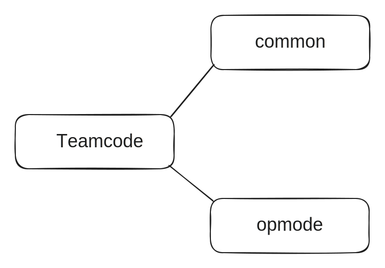

# The Structure of TeamCode
## Route

> FtcRobotController\TeamCode\src\main\java\org\firstinspires\ftc\teamcode

## 代码结构

```
teamcode
├─common
│  │  Globals.java
│  │  Robot.java
│  ├─command
│  │      Command.java
│  ├─drive
│  │      Drivetrain.java
│  ├─hardware
│  │      GamepadEx.java
│  ├─subsystem
│  │      Subsystem.java
│  ├─util
│  │      Alliance.java
│  │      OpModeState.java
│  └─vision
│      │  Vision.java
│      └─pipeline
└─opmode
    ├─auto
    │      Auto.java
    └─teleop
            Duo.java
            Solo.java
```

## Introducion

### Globals.java

This file contains some constants used in the programme, which must be adjusted according to your machine before being used.

### Robot.java

This document is the unified entrance for all modules and integrates the content of each section.

### Drivetrain.java

This file contains the code for the movement of the robot and applies to the movement of the machine as a whole.

### GamepadEx.java

This file contains extensions to the FTC SDK for joystick detection, simplifying the programming of joysticks.

### Subsystem.java

This document is a unified entrance for all subsystem modules and integrates the content of each subsystem.

### Command.java

This file contains functions that are implemented by multiple subsystems together, and a series of specific actions for each subsystem are intergrated here. For example, a sequence of actions such as releasing the claw, raising the arm and then retracting the arm.

### Auto.java

This file is the code for the auto phase.

### Duo.java

This file is the code for two-player teleop.

### Solo.java

This file is the code for single-player teleop.


